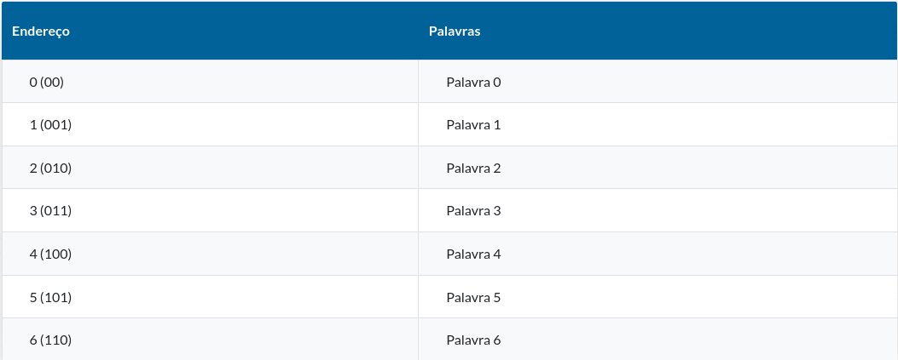
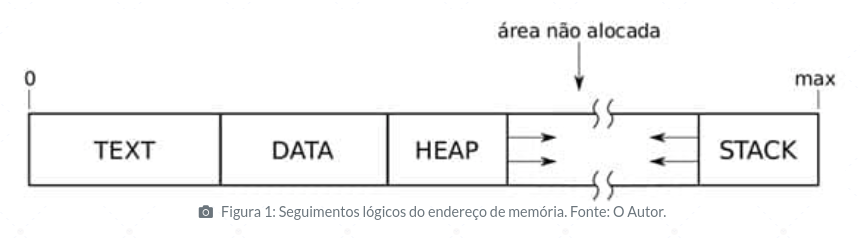

# INTRODUÇÃO

As estruturas de dados definem os diversos tipos de mecanismos que podem ser empregados para organizar os dados que serão tratados pelos algoritmos computacionais para a solução de um problema.

Escolher corretamente a estrutura de dados tem impacto direto no desempenho do algoritmo. Se você escolher uma estrutura inadequada, seu algoritmo terá um desempenho insatisfatório, acarretando uma má experiência.

Portanto, é necessário que estudemos os diversos tipos de estrutura de dados para permitir que você possa selecionar a estrutura mais adequada para a solução de um determinado problema, com um desempenho adequado.

Neste tema, iniciaremos pelo emprego dos ponteiros e, a seguir, conceituaremos estruturas heterogêneas, relembrando a definição de estruturas de dados e as diferenças entre as estruturas homogêneas e heterogêneas.

Aplicaremos os conhecimentos utilizando a linguagem C e desenvolvendo aplicações com ponteiros e structs, além de explorar recursos avançados, como as structs aninhadas e os vetores de structs.

* # Empregar ponteiros com a utilização da linguagem de programação C

## DEFINIÇÃO

Segundo Schildt (1996), ponteiro é uma variável que contém um endereço de memória. Podemos ainda definir o ponteiro como um tipo especial de variável, na qual o valor atribuído é um endereço de memória.

Ou seja, ponteiro ou apontador é uma variável capaz de armazenar um endereço de memória ou o endereço de outra variável.

Para entendermos melhor essa definição, precisamos compreender como a memória de um programa é organizada e o que é um endereço de memória.

## MEMÓRIA

Memória é um componente do computador responsável pelo armazenamento de dados e instruções. Ela é composta por palavras, sendo cada palavra identificada unicamente a partir de um endereço, ou seja, um endereço de memória.

Cada palavra tem uma capacidade de armazenamento da informação, isto é, uma quantidade de bytes que a palavra representa.

Sendo assim, aprendemos que uma memória é composta por palavras e que toda palavra possui um endereço único, conforme é visto na Tabela 1.

O endereço de memória de um processo em execução é dividido em vários segmentos lógicos. Destacamos alguns dos mais importantes:

* Text 

    Contém o código do programa e suas constantes. Este segmento é alocado durante a criação do processo (''exec'') e permanece do mesmo tamanho durante toda a vida do processo.

* Data 

    Este segmento é a memória de trabalho do processo, na qual ficam alocadas as variáveis globais e estáticas. Tem tamanho fixo ao longo da execução do processo.

* Stack

    Contém a pilha de execução, na qual são armazenados os parâmetros, endereços de retorno e variáveis locais de funções. Pode variar de tamanho durante a execução do processo.

* Heap 

    Contém blocos de memória alocadas dinamicamente, a pedido do processo, durante sua execução. Varia de tamanho durante a vida do processo.

